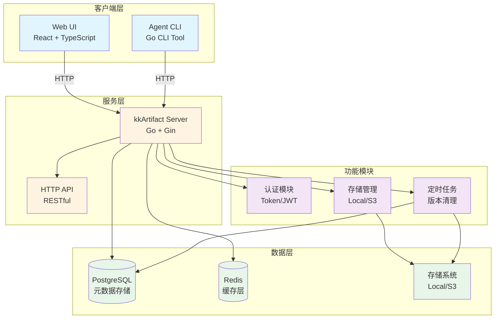

# kkArtifact

现代化的 Artifact 管理和同步系统，用于替代传统的 `rsync + SSH` 方案。

## 特性

- 🚀 **高性能传输**：支持并发上传/下载，可配置并发数量
- 🔄 **断点续传**：网络中断后自动续传，支持大文件传输
- 🔐 **安全认证**：Token 和用户名/密码双重认证机制
- 📦 **版本管理**：不可变版本存储，支持版本覆盖
- 🌐 **Web UI**：现代化的 Web 界面，支持项目、应用、版本管理
- 🔍 **智能同步**：自动同步存储和数据库，支持手动刷新
- ⚡ **高性能**：支持大规模部署（2000+ 模块，2TB+ 存储）
- 📊 **审计日志**：完整的操作审计追踪

## 系统架构



### 组件说明

- **Web UI**: 基于 React + TypeScript + Ant Design 的现代化管理界面
- **Agent CLI**: Go 编写的命令行工具，用于 Push/Pull 操作
- **Server**: Go + Gin 框架的 HTTP API 服务器
- **PostgreSQL**: 存储项目、应用、版本、Token、Webhook、审计日志等元数据
- **Redis**: 缓存层（计划中），用于提升性能
- **存储系统**: 支持本地文件系统或 S3 兼容的对象存储
- **认证模块**: 基于 Token 和 JWT 的认证机制
- **定时任务**: 自动清理超出保留数量的旧版本

## 快速开始

### 使用 Docker Compose（推荐）

```bash
# 启动所有服务
docker-compose up -d

# 查看日志
docker-compose logs -f

# 停止服务
docker-compose down
```

服务启动后：
- Web UI: http://localhost:3000
- API Server: http://localhost:8080
- 默认管理员账号: `admin` / `admin123`

### 使用 Agent

#### 安装

```bash
# 从源码构建
cd agent
go build -o kkartifact-agent ./main.go
```

#### 配置文件

创建 `.kkartifact.yml` 文件：

```yaml
server_url: http://localhost:8080
token: YOUR_TOKEN_HERE
concurrency: 8          # 并发上传/下载数量（默认：8）
chunk_size: 4MB         # 分块大小（可选）
retain_versions: 5      # 本地保留版本数（可选）
ignore:
  - logs/
  - tmp/
  - '*.log'
  - node_modules/
```

#### Push（上传）

```bash
kkartifact-agent push \
  --project myproject \
  --app myapp \
  --version v1.0.0 \
  --path ./dist \
  --config .kkartifact.yml
```

#### Pull（下载）

```bash
kkartifact-agent pull \
  --project myproject \
  --app myapp \
  --version v1.0.0 \
  --path ./deploy \
  --config .kkartifact.yml
```

## 核心功能

### 并发传输

通过 `concurrency` 参数控制同时上传/下载的文件数量，提升传输速度：

```yaml
concurrency: 8  # 默认值，可根据网络和服务器性能调整
```

- 小文件多：可设置更大的并发数（如 16、32）
- 大文件少：建议使用较小的并发数（如 4）
- 网络慢：建议使用较小的并发数（如 4-8）

### 断点续传

支持网络中断后自动续传，无需重新开始：

- **下载断点续传**：
  - 自动检查本地文件是否存在且 hash 匹配
  - 文件完整则跳过下载
  - 文件不完整则使用 HTTP Range 请求继续下载
  - 文件 hash 不匹配则删除后重新下载
  - 显示下载进度百分比

- **上传优化**：
  - 服务器支持版本覆盖，避免重复上传

### Web UI 功能

- 📁 **项目管理**：浏览和管理所有项目
- 📦 **应用管理**：查看每个项目的应用列表
- 📋 **版本管理**：查看版本列表和 Manifest 详情
- 🔑 **Token 管理**：创建、查看、删除 API Token
- 🔗 **Webhook 管理**：配置和管理 Webhooks
- ⚙️ **配置管理**：设置版本保留策略等
- 📝 **审计日志**：查看所有操作记录

### 存储同步

如果数据库丢失或手动操作了存储，可以使用同步功能重建数据库记录：

1. 在 Web UI 的 Projects 页面点击 "Sync Storage" 按钮
2. 系统会自动扫描存储目录，重建项目、应用和版本记录

## 配置说明

### Agent 配置（.kkartifact.yml）

| 参数 | 类型 | 必填 | 默认值 | 说明 |
|------|------|------|--------|------|
| `server_url` | string | ✅ | - | 服务器地址 |
| `token` | string | ✅ | - | API Token |
| `concurrency` | int | ❌ | 8 | 并发数量 |
| `chunk_size` | string | ❌ | - | 分块大小 |
| `retain_versions` | int | ❌ | - | 本地保留版本数 |
| `ignore` | array | ❌ | [] | 忽略的文件/目录模式 |

### 环境变量

#### Server

| 变量 | 默认值 | 说明 |
|------|--------|------|
| `SERVER_PORT` | 8080 | 服务器端口 |
| `DB_HOST` | postgres | 数据库主机 |
| `DB_PORT` | 5432 | 数据库端口 |
| `DB_NAME` | kkartifact | 数据库名称 |
| `DB_USER` | kkartifact | 数据库用户 |
| `DB_PASSWORD` | kkartifact | 数据库密码 |
| `STORAGE_TYPE` | local | 存储类型（local/s3） |
| `STORAGE_LOCAL_PATH` | /repos | 本地存储路径 |
| `ADMIN_USERNAME` | admin | 管理员用户名 |
| `ADMIN_PASSWORD` | admin123 | 管理员密码 |
| `SKIP_ADMIN_USER` | false | 是否跳过创建管理员用户 |
| `SKIP_ADMIN_TOKEN` | true | 是否跳过创建管理员 Token |
| `JWT_SECRET` | - | JWT 密钥（不设置则随机生成） |
| `VERSION_RETENTION_LIMIT` | 5 | 版本保留数量 |

#### Web UI

| 变量 | 默认值 | 说明 |
|------|--------|------|
| `WEB_UI_PORT` | 3000 | Web UI 端口 |
| `VITE_API_URL` | / | API 地址（使用 Nginx 代理时为 /） |

## API 文档

### 认证

所有 API 请求需要在 Header 中携带 Token：

```
Authorization: Bearer YOUR_TOKEN
```

### 主要端点

- `GET /api/v1/projects` - 获取项目列表
- `GET /api/v1/projects/:project/apps` - 获取应用列表
- `GET /api/v1/projects/:project/apps/:app/versions` - 获取版本列表
- `GET /api/v1/manifest/:project/:app/:hash` - 获取 Manifest
- `GET /api/v1/file/:project/:app/:hash?path=FILE_PATH` - 下载文件（支持 HTTP Range）
- `POST /api/v1/upload/init` - 初始化上传
- `POST /api/v1/file/:project/:app/:hash` - 上传文件
- `POST /api/v1/upload/finish` - 完成上传
- `POST /api/v1/login` - 用户登录（返回 JWT Token）
- `GET /api/v1/tokens` - 获取 Token 列表
- `POST /api/v1/tokens` - 创建 Token
- `DELETE /api/v1/tokens/:id` - 删除 Token
- `POST /api/v1/sync-storage` - 同步存储到数据库

## 开发

### 项目结构

```
.
├── server/          # 后端服务（Go）
│   ├── internal/
│   │   ├── api/     # API 处理器
│   │   ├── auth/    # 认证模块
│   │   ├── database/# 数据库模块
│   │   ├── storage/ # 存储模块
│   │   └── ...
│   └── main.go
├── agent/           # Agent 客户端（Go）
│   ├── internal/
│   │   ├── client/  # API 客户端
│   │   ├── cli/     # CLI 命令
│   │   ├── config/  # 配置解析
│   │   └── manifest/# Manifest 生成
│   └── main.go
├── web-ui/          # Web UI（React + TypeScript + Ant Design）
│   ├── src/
│   │   ├── pages/   # 页面组件
│   │   ├── api/     # API 客户端
│   │   └── ...
│   └── ...
└── docker-compose.yml
```

### 构建

```bash
# 构建 Server
cd server
go build -o kkartifact-server ./main.go

# 构建 Agent
cd agent
go build -o kkartifact-agent ./main.go

# 构建 Web UI
cd web-ui
npm install
npm run build
```

### 本地开发

```bash
# 启动数据库和 Redis
docker-compose up -d postgres redis

# 运行 Server（需要设置环境变量）
cd server
go run main.go

# 运行 Web UI（开发模式）
cd web-ui
npm run dev
```

## 性能优化

- ✅ 并发上传/下载
- ✅ HTTP Range 请求支持（断点续传）
- ✅ 数据库索引优化
- ✅ API 分页
- ✅ 响应压缩（Gzip）
- ✅ Redis 缓存（计划中）

## 许可证

MIT License

Copyright (c) 2025 kk
