# kkArtifact

现代化的 Artifact 管理和同步系统，用于替代传统的 `rsync + SSH` 方案。

## 特性

- 🚀 **高性能传输**：支持并发上传/下载，可配置并发数量
- 🔄 **断点续传**：网络中断后自动续传，支持大文件传输
- 🔐 **安全认证**：Token 和用户名/密码双重认证机制
- 📦 **版本管理**：不可变版本存储，支持版本覆盖
- 🌐 **Web UI**：现代化的 Web 界面，支持项目、应用、版本管理
- 🔍 **智能同步**：自动同步存储和数据库，支持手动刷新
- ⚡ **高性能**：支持大规模部署（2000+ 模块，2TB+ 存储）
- 📊 **审计日志**：完整的操作审计追踪

## 系统架构

```mermaid
graph TB
    subgraph "客户端层"
        WebUI[Web UI<br/>React + TypeScript]
        Agent[Agent CLI<br/>Go CLI Tool]
    end

    subgraph "服务层"
        Server[kkArtifact Server<br/>Go + Gin]
        API[HTTP API<br/>RESTful]
    end

    subgraph "数据层"
        DB[(PostgreSQL<br/>元数据存储)]
        Redis[(Redis<br/>缓存层)]
        Storage[存储系统<br/>Local/S3]
    end

    subgraph "功能模块"
        Auth[认证模块<br/>Token/JWT]
        StorageMgr[存储管理<br/>Local/S3]
        Scheduler[定时任务<br/>版本清理]
    end

    WebUI -->|HTTP| Server
    Agent -->|HTTP| Server
    Server --> API
    Server --> Auth
    Server --> StorageMgr
    Server --> Scheduler
    Server --> DB
    Server --> Redis
    StorageMgr --> Storage
    Scheduler --> Storage
    Scheduler --> DB

    style WebUI fill:#e1f5ff
    style Agent fill:#e1f5ff
    style Server fill:#fff4e1
    style API fill:#fff4e1
    style DB fill:#e8f5e9
    style Redis fill:#e8f5e9
    style Storage fill:#e8f5e9
    style Auth fill:#f3e5f5
    style StorageMgr fill:#f3e5f5
    style Scheduler fill:#f3e5f5
```



### 组件说明

- **Web UI**: 基于 React + TypeScript + Ant Design 的现代化管理界面
- **Agent CLI**: Go 编写的命令行工具，用于 Push/Pull 操作
- **Server**: Go + Gin 框架的 HTTP API 服务器
- **PostgreSQL**: 存储项目、应用、版本、Token、Webhook、审计日志等元数据
- **Redis**: 缓存层（计划中），用于提升性能
- **认证缓存**: 内存缓存，大幅减少数据库查询
- **存储系统**: 支持本地文件系统或 S3 兼容的对象存储
- **认证模块**: 基于 Token 和 JWT 的认证机制
- **定时任务**: 自动清理超出保留数量的旧版本

## 快速开始

### 使用 Docker Compose（推荐）

```bash
# 启动所有服务
docker-compose up -d

# 查看日志
docker-compose logs -f

# 停止服务
docker-compose down
```

服务启动后：
- Web UI: http://localhost:3000
- API Server: http://localhost:8080
- 默认管理员账号: `admin` / `admin123`

### 使用 Agent

#### 安装

**方式一：从 GitHub Releases 下载（推荐）**

访问 [GitHub Releases](https://github.com/kevin197011/kkArtifact/releases) 下载对应平台的二进制文件：

- **Linux (amd64)**: `kkartifact-agent-linux-amd64`
- **Linux (arm64)**: `kkartifact-agent-linux-arm64`
- **macOS (amd64)**: `kkartifact-agent-darwin-amd64`
- **macOS (arm64)**: `kkartifact-agent-darwin-arm64`
- **Windows (amd64)**: `kkartifact-agent-windows-amd64.exe`

下载后，添加执行权限（Linux/macOS）：
```bash
chmod +x kkartifact-agent-linux-amd64
mv kkartifact-agent-linux-amd64 /usr/local/bin/kkartifact-agent
```

**方式二：从源码构建**

```bash
# 从源码构建
cd agent
go build -o kkartifact-agent ./main.go
```

#### 配置文件

创建 `.kkartifact.yml` 文件：

```yaml
server_url: http://localhost:3000  # 服务器地址（使用前端代理时指向前端 URL）
token: YOUR_TOKEN_HERE             # API Token（从 Web UI 获取）
concurrency: 300                   # 并发数量（推荐：200-500，默认：8）
ignore:                            # 忽略的文件/目录模式
  - logs/
  - tmp/
  - '*.log'
  - node_modules/
  - .DS_Store
```

**配置说明：**
- `server_url`: 应指向前端 URL（如 `http://localhost:3000`）如果使用 Web UI，或直接指向后端（如 `http://localhost:8080`）如果仅使用 API
- `concurrency`: 根据项目规模调整，大规模项目（20,000+ 文件）推荐使用 300-500

#### Push（上传）

```bash
kkartifact-agent push \
  --project myproject \
  --app myapp \
  --version v1.0.0 \
  --path ./dist \
  --config .kkartifact.yml
```

**特性：**
- ✅ 并发文件上传（可配置并发数）
- ✅ 实时动态进度条显示（不滚动屏幕）
- ✅ 自动文件 hash 验证（跳过已存在文件）
- ✅ 支持版本覆盖（自动删除旧版本）

#### Pull（下载）

```bash
kkartifact-agent pull \
  --project myproject \
  --app myapp \
  --version v1.0.0 \
  --path ./deploy \
  --config .kkartifact.yml
```

**特性：**
- ✅ 并发文件下载（可配置并发数）
- ✅ 断点续传支持（自动恢复中断下载）
- ✅ 实时动态进度条显示（不滚动屏幕）
- ✅ 自动文件完整性验证（SHA256 校验）
- ✅ 智能跳过已存在且匹配的文件

#### 进度显示

Push 和 Pull 操作都会显示动态进度条，在同一行更新，不滚动屏幕：

```
[================================================] 50.0% (1000/2000) | Elapsed: 1:23 | Remaining: 1:23 | Speed: 12.0 files/s
```

进度条显示内容：
- 可视化进度条（50 个字符）
- 完成百分比
- 文件计数（当前/总计）
- 已用时间
- 预计剩余时间
- 传输速度（文件/秒）

完成后显示摘要：
```
Completed: 2000/2000 files in 4:18
Total time: 4m18s
```

## 核心功能

### 并发传输

通过 `concurrency` 参数控制同时上传/下载的文件数量，提升传输速度：

```yaml
concurrency: 300  # 推荐值：针对大规模文件传输（2000+ 文件）优化
```

**推荐配置：**
- 小型项目（< 1,000 文件）：50-100
- 中型项目（1,000-10,000 文件）：200-300
- 大型项目（10,000+ 文件）：300-500
- 默认值：8（适用于小型测试场景）

**注意事项：**
- 更高的并发数需要更多网络连接和服务器资源
- 服务器端已优化数据库连接池和 Token 认证缓存，支持高并发
- 建议根据实际网络带宽和服务器性能调整

### 断点续传

支持网络中断后自动续传，无需重新开始：

- **下载断点续传**：
  - 自动检查本地文件是否存在且 hash 匹配
  - 文件完整则跳过下载（节省时间和带宽）
  - 文件不完整则使用 HTTP Range 请求从断点继续下载
  - 文件 hash 不匹配则自动删除后重新下载
  - 支持大文件（>1GB）的可靠传输

- **上传优化**：
  - 服务器支持版本覆盖，自动删除旧版本数据
  - 自动检查文件 hash，跳过已上传的文件
  - 支持并发上传，大幅提升传输速度

### Web UI 功能

- 📁 **项目管理**：浏览和管理所有项目
- 📦 **应用管理**：查看每个项目的应用列表
- 📋 **版本管理**：查看版本列表和 Manifest 详情
- 🔑 **Token 管理**：创建、查看、删除 API Token
- 🔗 **Webhook 管理**：配置和管理 Webhooks
- ⚙️ **配置管理**：设置版本保留策略等
- 📝 **审计日志**：查看所有操作记录

### 存储同步

如果数据库丢失或手动操作了存储，可以使用同步功能重建数据库记录：

1. 在 Web UI 的 Projects 页面点击 "Sync Storage" 按钮
2. 系统会自动扫描存储目录，重建项目、应用和版本记录

## 配置说明

### Agent 配置（.kkartifact.yml）

| 参数 | 类型 | 必填 | 默认值 | 说明 |
|------|------|------|--------|------|
| `server_url` | string | ✅ | - | 服务器地址 |
| `token` | string | ✅ | - | API Token |
| `concurrency` | int | ❌ | 8 | 并发数量 |
| `chunk_size` | string | ❌ | - | 分块大小 |
| `retain_versions` | int | ❌ | - | 本地保留版本数 |
| `ignore` | array | ❌ | [] | 忽略的文件/目录模式 |

### 环境变量

#### Server

| 变量 | 默认值 | 说明 |
|------|--------|------|
| `SERVER_PORT` | 8080 | 服务器端口 |
| `DB_HOST` | postgres | 数据库主机 |
| `DB_PORT` | 5432 | 数据库端口 |
| `DB_NAME` | kkartifact | 数据库名称 |
| `DB_USER` | kkartifact | 数据库用户 |
| `DB_PASSWORD` | kkartifact | 数据库密码 |
| `STORAGE_TYPE` | local | 存储类型（local/s3） |
| `STORAGE_LOCAL_PATH` | /repos | 本地存储路径 |
| `ADMIN_USERNAME` | admin | 管理员用户名 |
| `ADMIN_PASSWORD` | admin123 | 管理员密码 |
| `SKIP_ADMIN_USER` | false | 是否跳过创建管理员用户 |
| `ADMIN_TOKEN` | - | 如果设置，使用此值创建管理员 Token；如果未设置，跳过创建 |
| `ADMIN_TOKEN_NAME` | admin-initial-token | 管理员 Token 名称 |
| `DB_MAX_OPEN_CONNS` | 50 | 最大数据库连接数（高并发场景） |
| `DB_MAX_IDLE_CONNS` | 10 | 最大空闲数据库连接数 |
| `JWT_SECRET` | - | JWT 密钥（不设置则随机生成） |
| `VERSION_RETENTION_LIMIT` | 5 | 版本保留数量 |
| `ENABLE_SWAGGER` | true | 是否启用 Swagger UI |

#### Web UI

| 变量 | 默认值 | 说明 |
|------|--------|------|
| `WEB_UI_PORT` | 3000 | Web UI 端口 |
| `VITE_API_URL` | / | API 地址（使用 Nginx 代理时为 /） |

## API 文档

系统提供完整的 Swagger API 文档，可通过 Web UI 访问：

**Swagger UI**: http://localhost:3000/swagger/index.html

Swagger UI 包含：
- 完整的 API 端点文档
- 请求/响应 Schema 定义
- 认证要求说明
- 交互式 API 测试功能

### 认证

所有 API 请求需要在 Header 中携带 Token：

```
Authorization: Bearer YOUR_TOKEN
```

### 主要端点

- `GET /api/v1/projects` - 获取项目列表
- `GET /api/v1/projects/:project/apps` - 获取应用列表
- `GET /api/v1/projects/:project/apps/:app/versions` - 获取版本列表
- `GET /api/v1/manifest/:project/:app/:hash` - 获取 Manifest
- `GET /api/v1/file/:project/:app/:hash?path=FILE_PATH` - 下载文件（支持 HTTP Range）
- `POST /api/v1/upload/init` - 初始化上传
- `POST /api/v1/file/:project/:app/:hash` - 上传文件
- `POST /api/v1/upload/finish` - 完成上传
- `POST /api/v1/login` - 用户登录（返回 JWT Token）
- `GET /api/v1/tokens` - 获取 Token 列表
- `POST /api/v1/tokens` - 创建 Token
- `DELETE /api/v1/tokens/:id` - 删除 Token
- `POST /api/v1/sync-storage` - 同步存储到数据库

## 开发

### 项目结构

```
.
├── server/          # 后端服务（Go）
│   ├── internal/
│   │   ├── api/     # API 处理器
│   │   ├── auth/    # 认证模块
│   │   ├── database/# 数据库模块
│   │   ├── storage/ # 存储模块
│   │   └── ...
│   └── main.go
├── agent/           # Agent 客户端（Go）
│   ├── internal/
│   │   ├── client/  # API 客户端
│   │   ├── cli/     # CLI 命令
│   │   ├── config/  # 配置解析
│   │   └── manifest/# Manifest 生成
│   └── main.go
├── web-ui/          # Web UI（React + TypeScript + Ant Design）
│   ├── src/
│   │   ├── pages/   # 页面组件
│   │   ├── api/     # API 客户端
│   │   └── ...
│   └── ...
└── docker-compose.yml
```

### 构建

```bash
# 构建 Server
cd server
go build -o kkartifact-server ./main.go

# 构建 Agent
cd agent
go build -o kkartifact-agent ./main.go

# 构建 Web UI
cd web-ui
npm install
npm run build
```

### 本地开发

```bash
# 启动数据库和 Redis
docker-compose up -d postgres redis

# 运行 Server（需要设置环境变量）
cd server
go run main.go

# 运行 Web UI（开发模式）
cd web-ui
npm run dev
```

## CI/CD 和发布

项目使用 GitHub Actions 实现自动化构建和发布。

### 自动构建和发布

当推送版本标签（格式：`v*`，如 `v1.0.0`）到仓库时，GitHub Actions 会自动：

1. **构建 Docker 镜像**
   - Server 镜像：推送到 `ghcr.io/<OWNER>/<REPO>/server`
   - Web UI 镜像：推送到 `ghcr.io/<OWNER>/<REPO>/web-ui`
   - 使用 GitHub Packages (ghcr.io) 作为容器镜像仓库

2. **构建 Agent 二进制文件**
   - 支持多平台：Linux、macOS、Windows
   - 支持多架构：amd64、arm64
   - 生成 SHA256 校验和文件

3. **创建 GitHub Release**
   - 自动创建 Release
   - 上传所有平台的二进制文件
   - 生成并上传校验和文件

### 使用 Docker 镜像

**从 GitHub Packages 拉取镜像**

```bash
# 登录 GitHub Packages（需要 Personal Access Token，scope: read:packages）
echo $GITHUB_TOKEN | docker login ghcr.io -u USERNAME --password-stdin

# 拉取镜像
docker pull ghcr.io/kevin197011/kkArtifact/server:v1.0.0
docker pull ghcr.io/kevin197011/kkArtifact/web-ui:v1.0.0
```

**在 docker-compose.yml 中使用**

```yaml
services:
  server:
    image: ghcr.io/kevin197011/kkArtifact/server:latest
    # ...
  web-ui:
    image: ghcr.io/kevin197011/kkArtifact/web-ui:latest
    # ...
```

**注意**：
- GitHub Packages 镜像默认是私有的（如果是私有仓库）
- 可以通过仓库的 Packages 页面设置为公开
- 需要使用 Personal Access Token 进行认证

### 手动触发构建

1. 访问 GitHub 仓库的 Actions 页面
2. 选择 "Build and Release" 工作流
3. 点击 "Run workflow" 按钮
4. 选择分支并点击 "Run workflow"

更多详细信息请参考 [.github/workflows/README.md](.github/workflows/README.md)。

## 性能优化

### 客户端优化
- ✅ 并发上传/下载（可配置并发数，推荐 200-500）
- ✅ HTTP 连接池优化（复用连接，减少握手开销）
- ✅ HTTP Range 请求支持（断点续传，节省带宽）
- ✅ 动态进度条显示（减少输出，提升终端性能）

### 服务端优化
- ✅ Token 认证缓存（减少 99%+ 数据库查询）
  - 已验证 Token 缓存（5 分钟 TTL）
  - Token 列表缓存（1 分钟刷新）
- ✅ 数据库连接池优化
  - 最大连接数：50（可配置）
  - 最大空闲连接：10（可配置）
  - 连接生命周期：5 分钟
  - 空闲连接超时：1 分钟
- ✅ PostgreSQL 连接数优化（`max_connections=200`）
- ✅ 数据库索引优化（加速查询）
- ✅ API 分页（减少数据传输）
- ✅ 响应压缩（Gzip）
- ✅ Redis 缓存（计划中）

## 许可证

MIT License

Copyright (c) 2025 kk
